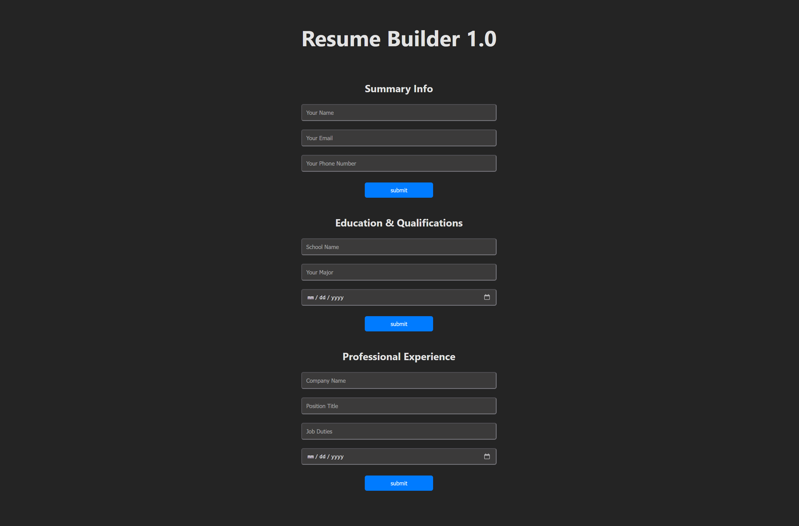

# **Resume Builder React App**
## *Version 1.0*

Hey there! Welcome to my **Resume Builder 1.0** project. This was my first stab at building something with React. Nothing fancy, just a fun way to practice some core concepts.

**Here’s a screenshot of what it looks like:**

### Netlify Permalink
> https://simple-resume-app.netlify.app/

---

## What It Is
> *A simple resume builder app built with React. It uses form fields to prompt and capture user inputs, which are then rendered in 3 sections - Summary Information, Education, and Work Experience. Users also have the option to edit their entries after submission since their inputs persist across renders.*

## How It’s Built
> *DON'T Repeat Yourself!*

I used React to break everything down into components, which made the code easier to manage helped me to keep the code DRY.

- **App Component:** The glue that holds the component states (in this case just 1 object) and sends data to the other components.
- **Section Components:** `General`, `Education`, and `Experience` handle their own input fields and display logic.
- **Reusable Bits:** `Input` and `Button` components to keep things consistent and save me from repeating myself (though I've unironically emphasized DRY 3x in the last 5 lines).

## What I Learned

- **State Management:** Using `useState` to track form inputs and flip between edit and display modes.
- **Props:** Passing data from the `App` component to the sections like a pro.
- **Reusable Components:** Making `Input` and `Button` so I didn’t have to rewrite the same stuff over and over.
- **Form Handling:** Grabbing user input and updating the screen when they hit submit.

While simple, it was a lot of fun to build, and really helped solidify my understanding of React basics.

## Check It Out

You can play with the app live on [Vercel](https://simple-resume-app.vercel.app/) or [Netlify](https://simple-resume-app.netlify.app/).
